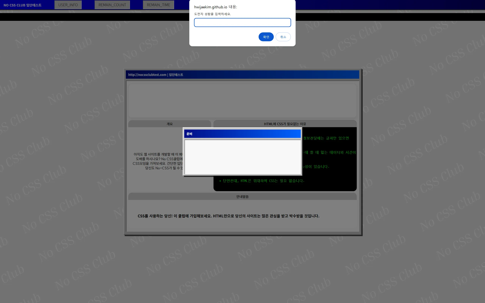
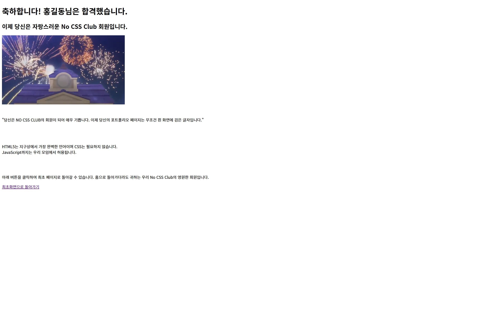

+++
date = '2024-06-20'
draft = false
title = '자바스크립트프로그래밍 교과목 기말 프로젝트 [No CSS Club 미니게임]'
description = '계원예술대학교'
categories = [
    'Projects',
    'Code',
]
tags = [
    'web-publishing', 'html/css/js', 'game'
]
image = 'teaser.webp'
+++
<style>
  .ico {
    border-radius: 5px;
    height: 30px;
    margin-bottom: 5px;
  }
</style>
<br>

## 📝 No CSS Club에 가입하기 위해 마우스 클릭으로 제한시간 내 모든 CSS 클래스를 제거하는 미니게임

| 구분 | 내용 |
| :--- | :--- |
| **기간**    | 2023.10 ~ 2023.12 (2-1학기)                                                                                     |
| **인원**    | 개인                                                                                    |
| **담당분야**  | 게임 콘텐츠, 웹UI 디자인 구축 및 기능 구현                                    |
| **관련 링크** | ***레퍼런스***<br><a href="https://nocss.club" target="_blank">nocss.club</a><br>  ***게임플레이***<br><a href="https://hwijaekim.github.io/nocssclub_minigame" target="_blank">https://hwijaekim.github.io/nocssclub_minigame</a> |

<br><br>

## 🔑 핵심 기술 요약
- CSS만을 사용하여 구현한 Windows 95~ME 스타일의 UI
- `Vanilla JavaScript`로 카운트, 남은 시간, 인게임 진행 등 프로그래밍 구현
- `localStorage`기능으로 사용자명을 로컬에 저장해 페이지가 전환되어도 호출할 수 있도록 프로그래밍
- CSS에서 마우스 커서 커스텀
- `JavaScript`에서 `setTimeout`, `setInterval` 지연실행, 초 단위 카운트 기능을 구현

<br><br>

video

<br>







<br><br>

## 📌 주요 코드
### `localStorage`
*프롬프트로 도전자명을 받아 로컬에 저장*
```javascript
//도전자명 입력
let user = prompt('도전자 성함을 입력하세요.');
document.querySelector('.user').innerHTML = user + '님의 도전';

localStorage.setItem('localStorageName', user);
```
*클리어 페이지(다른html)에서 `localStorage`에 저장된 값을 불러와 출력*
```javascript
let name = localStorage.getItem('localStorageName');
let nameBox = document.getElementById('name');

nameBox.innerHTML = name;
```


### 시작 전 준비 카운트
```javascript
//시작 전 준비 카운트
let readyContainer = document.getElementById('ready');  /*id가 ready인 section 변수 지정*/
let readyNum = document.querySelector('.ready_content h1'); /*카운트 문구*/
let readyCount = 5; /*초기값5, 5초*/
let readyTime = setInterval(() => {
    readyCount--;
    readyNum.innerHTML = readyCount + '초 뒤 시작';
}, 1000)

let readyBg = document.getElementById('dark_bg');  /*어둡게 깔리는 배경*/

/*5초가 지나면 readyContainer와 readBg에 active클래스를 add 하여 display: none;*/
setTimeout(() => {
    clearInterval(readyTime);
    readyContainer.classList.add('active');
    readyBg.classList.add('active');
}, 5000)
```

### 인게임 기능 구현
```javascript
//게임구현
let gm_regContainerP = document.querySelector('.top');
let gm_title = document.querySelector('.title');
let gm_titleText = document.querySelector('.title h1');
let clearContainer = document.getElementById('clear');

gm_title.addEventListener('click', () => {
    gm_titleText.classList.remove('active');
    console.log('성공적으로 제거됨:', gm_title);
})

let divs = document.querySelectorAll('div');
let correct_sound = document.getElementById('correct_sound');
let clear_sound = document.getElementById('clear_sound');

divs.forEach(event => {
    event.addEventListener('click', (i) => {
        /*초반에 작성한 코드로는 한 번 클릭시 여러 개의 클래스가 동시에 삭제되는 버그가 있어
        구글검색을 통해 stopPropagation() 기능을 참조하여 코드를 수정하였음

        메서드의 상세한 기능은 ChatGPT가 설명해주었으며 클릭된 요소의 자식 요소까지
        전파되는 것을 방지하는 기능으로 이해함*/

        i.stopPropagation();
        
        if(event.classList.length > 0) {
            console.log('클래스를 포함하고 있음');
            correct_sound.play()

            event.className = '';
            console.log('클래스가 성공적으로 제거됨: ', event);

            remainElement--;
            displayRemain.innerHTML = remainElement + '개 남음';

            if(remainElement === 0){  //성공
                clearContainer.classList.add('active');
                readyBg.classList.remove('active');
                clear_sound.play();

                setTimeout(() => {
                    window.location.href = './clear.html';
                }, 3000);
            }
        }
        else {
            console.log('클래스를 포함하고 있지 않음');
        }
    })
})

```

<br><br>

## 🖥️ 사용 기술


<br><br>

## ⌨️ 총평
- **Good Parts**
  - `JavaScript`를 배우는 단계에서 처음으로 제작한 웹 게임
  - `Vanilla JavaScript`의 여러 기능을 사용하고 적용하여 어떤 방식으로 작동하는지 알 수 있게 되었음

- **Bad Parts**
  - 배우는 단계인 만큼 주석문을 적극적으로 사용해야 하는데 그러지 못 하였음
  - 최대한 스스로 진행하려 했지만 일부 코드에서 chatGPT의 도움을 받아 이해하여 적용하였음
  - 인게임에서 클릭 변수를 `querySelectorAll('div')`와 같이 `div`태그 전체를 선언하여 내부적으로 의도하지 않은 문제가 발생할 가능성이 높아짐