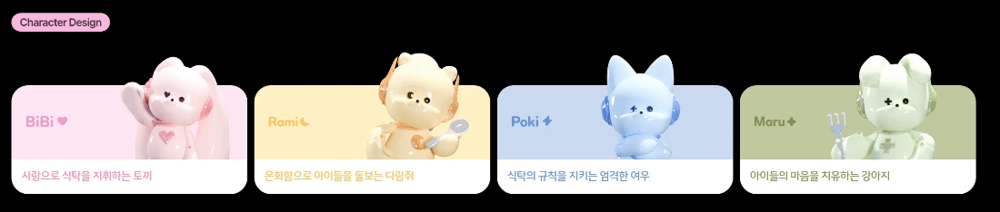
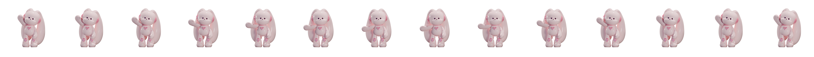

+++
date = '2024-11-11'
draft = false
title = '계원예술대학교 디지털미디어디자인과 졸업작품 학과우수작[잇토피아]'
description = '계원예술대학교'
categories = [
    'Projects', 'Code'
]
tags = [
    'web-publishing', 'html/css/js', 'figma', '졸업작품'
]
image = 'teaser.webp'
+++
<style>
  .ico {
    border-radius: 5px;
    height: 30px;
    margin-bottom: 5px;
  }
</style>
<br>

## 📝 유아기 아이들의 식습관 문제 개선을 위한 XR글래스 콘텐츠

| 구분 | 내용 |
| :--- | :--- |
| **기간**    | 2024.09 ~ 2024.11  (2-2학기)                                                                                      |
| **인원**    | 기획2, 디자인3, **개발1**                                                                                       |
| **담당분야**  | 서비스 영상 촬영 및 웹 사이트 구현                                    |
| **관련 링크** | <a href="https://hwijaekim.github.io/eatopia2024" target="_blank">https://hwijaekim.github.io/eatopia2024</a> |

   <br><br>

## 🔑 핵심 기술 요약
- 웹 표준을 준수한 시멘틱 태그 사용
- `Vanilla JavaScript`에 기반한 `Observer` 적극 활용으로 스크롤 시 `keyframe`애니메이션 구현
- CSS 가상클래스 사용으로 글꼴 크기, 색상 등을 공통으로 관리
- CSS Step Animation 사용
- `svg`, `webp` 확장자 사용
- Git을 이용한 GitHub 리포지토리를 Clone, 버전관리

<br><br>

<iframe src="https://www.youtube-nocookie.com/embed/GXoRwVcUX-Q?si=eMEHC841TNv-l3lc" title="YouTube video player" frameborder="0" allow="accelerometer; autoplay; clipboard-write; encrypted-media; gyroscope; picture-in-picture; web-share" referrerpolicy="strict-origin-when-cross-origin" allowfullscreen></iframe>

<br><br>

## 📌 주요 코드
### 가상 클래스
```css
:root {
    /*공통수치 통합관리*/
    --union-line-height: 1.35;

    /*컬러 관리*/
    --background: #000000;
    --systemColor: #ffffff;
    --systemColorD: rgba(0, 0, 0, 0.85);
    --systemColorLD: rgba(0, 0, 0, .6);
    --sectorTitleColor: rgba(255, 255, 255, 0.8);
    --pinkL: #F4AFDD;
    --pinkD: #CF8AB8;
    --pinkUD: #B06E9A;
    --yellowL: #F7DC75;
    --yellowD: #D3BA59;
    --yellowUD: #C29D13;
    --blueL: #BCD1EB;
    --blueD: #98B1D1;
    --blueUD: #7A96B8;
    --greenL: #9EB366;
    --greenD: #829945;
    --greenUD: #6E8630;
    --ivory: #EDE7D9;

/*    글꼴크기 관리*/
    --text-xlarge: 3vw;
    --text-large: 2.3vw;
    --text-medium: 1.6vw;
    --text-regular: 1.3vw;
    --text-semi-medium: 1.5vw;
    --text-small: 1vw;
    --text-extra-small: 0.75vw;
   
}
```
### Step Animation




```css
.stepAni {
    /* border: solid 1px red; */
    display: inline-block;
    width: 8vw;
    aspect-ratio: 1 / 1;
    background-image: url("../sources/stepAni/maru_fork_step.webp");
    background-size: cover;
    transform: translate(-8vw, -3vh);
    animation: stepAni 1s steps(10) infinite alternate;
}
@keyframes stepAni {
    100% { background-position: calc(8vw * 10) 0; }
}
```

[//]: # ()
[//]: # (## `Observer` 코드 경량화)

[//]: # (```javascript)

[//]: # ()
[//]: # (```)

[//]: # ()
[//]: # (<br><br>)

[//]: # ()
[//]: # (---)

<br><br>

## 🖥️ 사용 기술


<br><br>


<br><br>

## ⌨️ 총평
- **Good Parts**
  - 프로젝트 시작 단계부터 웹 표준을 준수한 시멘틱 태그 사용
  - 본격적으로 디자이너와 협업하여 제작한 팀 프로젝트
  - Git 버전관리를 처음으로 사용해본 프로젝트로 GitHub에 더 빠르게 commit
  - CSS 가상클래스 사용으로 공통요소를 관리하여 정리 및 유지보수에 이바지
  - `jpg`, `gif` 사용을 줄이고 `webp` 사용을 지향하여 웹 사이트 경량화
  - `svg`사용으로 벡터 기반의 이미지를 삽입, `svg animation`을 이용한 시각적 재미요소 삽입

- **Bad Parts**
  - 촉박한 프로젝트 진행 시간으로 인해 일부 섹션에서 통 이미지로 삽입하였음
  - 일부 영역에`inline style` 사용으로 우선순위에 충돌이 생기고 유지보수가 힘들어짐
    ```css
    <div style="transform: translate(.7vw, 5vw);" class="stepAni2_inline"></div>
    ```
  - `HTML`에서 `depth`가 많아짐
    ```html
    <body>
      <div id="wrap">
        <main>
        <!-- SECTOR 03 -->
        <div id="sec3_bg">
          <section id="sector3">
            <article id="summary">
              <div class="summary_flexbox sec3_Observer">
                  <div class="textFlex">
                      <p class="sub"><small>그렇다면,</small></p>
                      <p>
                          <span class="pink bold">아이의 잘못된 식습관은</span><br> 부모에게 어떤 영향을 줄까요?
                      </p>
                  </div>
                  <div class="imgFlex">
                      
                  </div>
                </div>
            </article>
          </section>
        </div>
        </main>
      </div>
    </body>
    ```