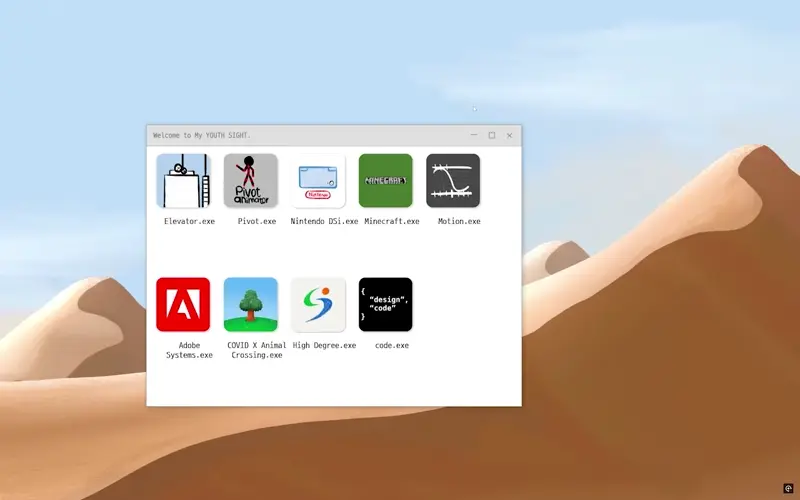
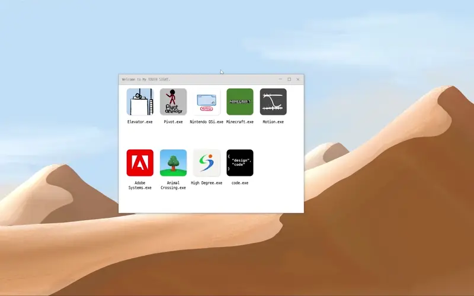

+++
date = '2024-11-22'
draft = false
title = '웹인터랙션프로그래밍 교과목 프로젝트 [My Origin Wizard]'
description = '계원예술대학교'
categories = [
    'Projects', 'Code'
]
tags = [
    'web-publishing', 'html/css/js'
]
image = 'teaser.webp'
+++
<style>
  .ico {
    border-radius: 5px;
    height: 30px;
    margin-bottom: 5px;
  }
</style>
<br>

## 📝 나의 일대기 9가지 페이지를 JavaScript 기반의 상호작용 사이트로 제작

| 구분 | 내용 |
| :--- | :--- |
| **기간**    | 2024.09 ~ 2024.12 (2-2학기)                                                                                     |
| **인원**    | 개인                                                                                         |
| **담당분야**  | 사이트 콘셉트 수립, 9개 콘텐츠 기획 및 기능구현                                    |
| **관련 링크** | <a href="https://hwijaekim.github.io/my-origin-wizard/index.html" target="_blank">https://hwijaekim.github.io/my-origin-wizard</a> |

<br><br>


## 🔑 핵심 기술 요약
- `display: flex;`, `flex-flow: row wrap;` 스타일 적용으로 윈도우 크기변화에 따른 적절한 아이콘 배치
- `JQuery UI` 사용으로 `index.html`에서 윈도우 창 드래그 기능 구현
- `forEach`를 이용해 `index.html`에서 각 아이콘 클릭에 대한 페이지 전환을 자연스럽고 적은 양의 코드로 구현

<br><br>
<iframe width="560" height="315" src="https://www.youtube-nocookie.com/embed/sVCvbcAeFW4?si=-_R6b9hT8Qhtx_MY" title="YouTube video player" frameborder="0" allow="accelerometer; autoplay; clipboard-write; encrypted-media; gyroscope; picture-in-picture; web-share" referrerpolicy="strict-origin-when-cross-origin" allowfullscreen></iframe>
<br><br>

## 📌 주요 코드
### `flex` 아이콘 배치 + JQuery UI를 이용한 드래그 구현
```css
#win_contents {
    /*border: solid 1px red;*/
    width: 95%;
    height: 90%;
    margin: 0 auto;
    display: flex;
    flex-flow: row wrap;
    align-items: baseline;
}
```
```javascript
$(() => {
    $('#win_container').draggable();
})
```


### `forEach`로 각 9개의 아이콘을 클릭하여 페이지 전환 구현
```javascript
//index.html에서 각 아이콘 클릭시 화면전환 기능 구현
const icons = document.querySelectorAll('.iconFlex');  //총 9개의 iconFlex 클래스를 querySelectorAll 배열로 변수 지정
const popupBox = document.getElementById('popup');  //아이콘 클릭시 자연스럽게 전환될 수 있도록 popup id 변수 지정

icons.forEach((icon,index) => {  //iconFlex div를 forEach, 클릭된 icon의 순서를 알기 위해 index를 추가로 선언
    icon.addEventListener('click', () => {  //icon을 클릭하면
        popupBox.classList.add('active');  //미리 선언해둔 팝업 변수에 active클래스를 추가하여 keyframe애니메이션 재생

        //핵심 코드. popupBox에 active 클래스가 추가되고 1초 후 내부 코드 실행
        setTimeout(() => {
            /*
            * index페이지 전환 코드
            * 각 서브 페이지 이름은 1~9.html로 지정해 두었음
            * forEach에서 선언한 index값은 클릭한 icon의 순서
            * querySelectorAll로 불러온 배열은 0부터 시작하므로 클릭한 index에 1을 더함
            * 최종적으로 백틱을 사용하여 클릭한 icon에 대한 순서(index)값+1.html 파일을 1초 후 열도록 프로그래밍
            * ex. 6번째 아이콘을 클릭 -> index값은 5 -> 5+1 => 6.html 1초 후 전환
            * */
            window.location.href = `./${index + 1}.html`;
        }, 1000);
    })
})
```


### SVG의 path 내 속성값을 변경해 애니메이션을 구현
```html
<!--SVG 중 일부-->
<path id="bezier-control" d="M10.5 327C73 251.167 243.3 99.5 424.5 99.5C605.7 99.5 776.667 250.833 839.5 326.5" stroke="#D0D0D0" stroke-width="1.5"/>

<!--버튼-->
<div id="btn-cluster">
    <button class="graph-btn"></button>
    <button class="graph-btn"></button>
    <button class="graph-btn"></button>
    <button class="graph-btn"></button>
</div>
```
```javascript
// svg중 bezier 부분 path, 움직일 원, 버튼 4개를 변수로 선언
const bezierControl = document.getElementById('bezier-control');
const ballObj = document.getElementById('ball');
const bezierBtn = document.querySelectorAll('.graph-btn');

// NodeList로 나열된 bezierBtn을 forEach로 풀어주기
bezierBtn.forEach((btn, index) => {
    btn.addEventListener('click', () => {
        // 버튼 순서대로 클릭시 index값을 통해 if문으로 조작
        if(index === 0) {
            /*
            * 해당 변수 내 요소의 속성값을 변경할 수 있는 메서드.
            * (변수).setAttribute(속성명, 속성값);
            * */
            bezierControl.setAttribute(
                // 해당 변수 path 내 포함된 요소 "b"에 대한 속성값을 아래와 같이 변경한다.
                "d",
                "M10.5 327C73 251.167 243.3 99.5 424.5 99.5C605.7 99.5 776.667 250.833 839.5 326.5"
            );
            // 추가된 모든 클래스를 제거
            ballObj.className = '';
        }
        else if(index === 1) {
            bezierControl.setAttribute(
                "d",
                "M10.5 327C43.5 327 132 99.5 214.5 99.5C335 99.5 332.5 326.5 839.5 326.5"
            );
            //추가된 모든 클래스를 제거하고 graph2 클래스를 add
            ballObj.className = '';
            ballObj.classList.add('graph2');
        }
    })
})
```


<br><br>

## 🖥️ 사용 기술


<br><br>

## ⌨️ 총평
- Good Parts
  - CSS와 JS를 통합하여 제작했을 때 발생할 수 있는 문제를 경험하고 해결
  - HTML/CSS와 JS를 보다 긴밀하게 연결하여 여러 상호작용 요소를 구현
  - 코드 주석처리에 대한 습관
  - SVG와 CSS Animation을 적극 활용
- Bad Parts
  - 구현 가능성과 시간분배로 인한 콘텐츠 타협