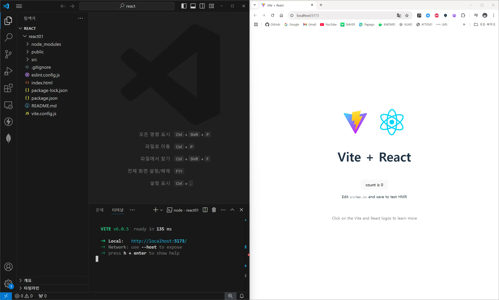

+++
date = '2024-12-20'
draft = false
title = 'React 시작 + 문제 해결'
categories = [
    'Development', 'Research'
]
tags = [
    'node.js', 'npm', 'vite', 'react'
]
image = 'teaser.webp'
+++
| **참고 강의** | <a href="https://codingapple.com/course/react-basic/" target="_blank">coding apple - React 리액트 기초부터 쇼핑몰 프로젝트까지!</a> |

<br>

***Node.js 사전설치 완료***   
처음에는 `create-react-app` 명령어로 시도했지만 추후 vite를 이용함.


## Vite를 이용한 React 프로젝트 생성
```bash
npm create vite@latest
```
```bash
gimhwijae@gimhwijaeui-MacBookPro react01 % npm create vite@latest

> react01@0.0.0 npx
> create-vite

? Project name: › vite-project [프로젝트명 입력]
```
```bash
? Select a framework: › - Use arrow-keys. Return to submit.
❯   Vanilla
    Vue
    React
    Preact
    Lit
    Svelte
    Solid
    Qwik
    Angular
    Others
```
방향키를 사용해 React에서 엔터

```bash
? Select a variant: › - Use arrow-keys. Return to submit.
❯   TypeScript
    TypeScript + SWC
    JavaScript
    JavaScript + SWC
    React Router v7 ↗
```
방향키를 이용해 JavaScript에서 엔터

```bash
Scaffolding project in /Users/gimhwijae/Git/react-practice/react01...

Done. Now run:

  cd react01
  npm install
  npm run dev

gimhwijae@gimhwijaeui-MacBookPro react-practice % 
```
다음 명령을 차례로 입력하여 실행


<br>

### 오류 빌생
macOS 환경에서 다음과 같은 오류가 발생함
><sub>`failed to load config from /Users/gimhwijae/Git/react-practice/react01/vite.config.js
error when starting dev server:
Error: Build failed with 3 errors:
(define name):1:0: ERROR: Expected identifier but found "import"
(define name):1:0: ERROR: Expected identifier but found "import"
(define name):1:0: ERROR: Expected identifier but found "import"
    at failureErrorWithLog (/Users/gimhwijae/Git/react-practice/react01/node_modules/esbuild/lib/main.js:1476:15)
    at /Users/gimhwijae/Git/react-practice/react01/node_modules/esbuild/lib/main.js:945:25
    at runOnEndCallbacks (/Users/gimhwijae/Git/react-practice/react01/node_modules/esbuild/lib/main.js:1316:45)
    at buildResponseToResult (/Users/gimhwijae/Git/react-practice/react01/node_modules/esbuild/lib/main.js:943:7)
    at /Users/gimhwijae/Git/react-practice/react01/node_modules/esbuild/lib/main.js:970:16
    at responseCallbacks.<computed> (/Users/gimhwijae/Git/react-practice/react01/node_modules/esbuild/lib/main.js:622:9)
    at handleIncomingPacket (/Users/gimhwijae/Git/react-practice/react01/node_modules/esbuild/lib/main.js:677:12)
    at Socket.readFromStdout (/Users/gimhwijae/Git/react-practice/react01/node_modules/esbuild/lib/main.js:600:7)
    at Socket.emit (node:events:519:28)
    at addChunk (node:internal/streams/readable:559:12)`</sub>

<br>

#### 실패과정
Google 검색과 chatGPT를 이용하여 오류를 검색하고 많은 해결법을 시도해 봤지만 여전히 같은 오류가 발생했음.   
<br>
**터미널 입력**
```bash
npm i react@18 react-dom@18
```
설명: 최근 출시된 리액트19 릴리즈에서 의존성 버전 문제를 일으킨 것으로 추정. 하지만 어디까지나 임시 해결책으로 장기적으로는 권장되지 않음.   
<br>

하지만 위와 같은 해결법은 임시 해결법으로 **React 19 출시와 함께 의존성에 대한 오류**가 발생한 것으로 추정되었음.   

<br>

### 해결
Node.js버전은 당시 **v20.17.0**으로 공식적으로는 문제가 없었지만 마지막 방법으로 LTS최신버전인 **v22.12.0** 버전으로 업데이트 함.   
결과적으로 문제 없이 `npm run dev` 명령어가 작동하였으며 `localhost`로 잘 작동함.   
<br>


<br>

하지만 여기서 드는 의문점은 **Windows 환경.**   
Windows에서의 Node.js 버전은 **v20.17.0**으로 **macOS와 동일한 버전**이지만 React 환경이 정상적으로 실행됐음   




<br>
---
<br>


## 프로젝트 시작

### 기본 형식
```jsx
import { useState } from 'react'
import reactLogo from './assets/react.svg'
import viteLogo from '/vite.svg'
import './App.css'

function App() {
  const [count, setCount] = useState(0)

  return (
    <div>
      <div className="black-nav">
        <h4>Code Blog.</h4>
      </div>
    </div>
  )
}

export default App
```
기본이 되는 `App.jsx`파일.   
`return{}` 내부에 HTML을 작성하면 된다.
<br><br>
*`JavaScript` 내에서 HTML을 작성할 수 있는 이유는 사실 해당 코드는 HTML이 아닌 JSX이기 때문.
하지만 우리에게 친숙한 HTML 문법을 사용하여 코드를 작성할 수 있도록 보여지는 것.

<br><br>

### JSX 내에서 클래스 선언
<sub>틀린 예</sub>
```jsx
      <div classe="black-nav">
        <h4>Code Blog.</h4>
      </div>
```

<sub>옳은 예</sub>
```jsx
      <div classeName="black-nav">
        <h4>Code Blog.</h4>
      </div>
```
JSX 내에서 클래스를 선언하기 위해 기존 HTML 문법과 같이 `class="test"`로 작성해서는 안 된다.
<br><br>
기본적으로 JSX(JavaScript XML)는 마크업 언어인 HTML과는 다르게 프로그래밍 언어이기 때문에 CSS에서의 `class` 아닌 프로그래밍 부분의 `class`와 혼동될 수 있다.
<br><br>
이러한 혼동을 막기 위해 JSX내에서 `div`에 클래스를 선언하기 위해서는 `className`으로 선언해야 한다.

<br><br>

### 중괄호 문법
JSX에서는 중괄호 문법을 이용하여 어디든 변수를 선언하고 삽입할 수 있다.

```jsx
function App() {
  const [count, setCount] = useState(0)

  let post = '변수선언';

  return (
    <div>
      <div className="black-nav">
        <h4>Code Blog.</h4>
      </div>

      <h4>{ post }</h4>

      <h4 style={ {color: 'blue'} }>JSX에서 Inline Style은 다음과 같이 작성해야 합니다.</h4>
    </div>
  )
}
```
위와 같이 `let post = '변수선언';`와 같이 변수를 선언한다. (문법 자체는 JS와 동일)
<br><br>
다음 단계부터 JS와의 차이가 존재하는데 실제 JS에서 변수를 선언하고 HTML에 삽입하려면 `document.getElementbyID('title').innetHTML = '변수선언'`과 같이 길고 복잡한 코드를 작성해야 했지만 JSX에서는 `{ post }`만 작성하면 해당 변수가 삽입된다.

<br><br>

### JSX 내에서 인라인 스타일 작성
JSX에서 작성하는 인라인 스타일은 HTML과 유사하면서 차이가 존재한다.

```jsx
<h4 style={ {color: 'blue', fontSize: '24px'} }>JSX에서 Inline Style은 다음과 같이 작성해야 합니다.</h4>
```
기본적으로 중괄호가 추가된 모습이고 카멜케이스를 적용하여 작성해야 한다.   
예시. `font-size` ->  `fontSize`