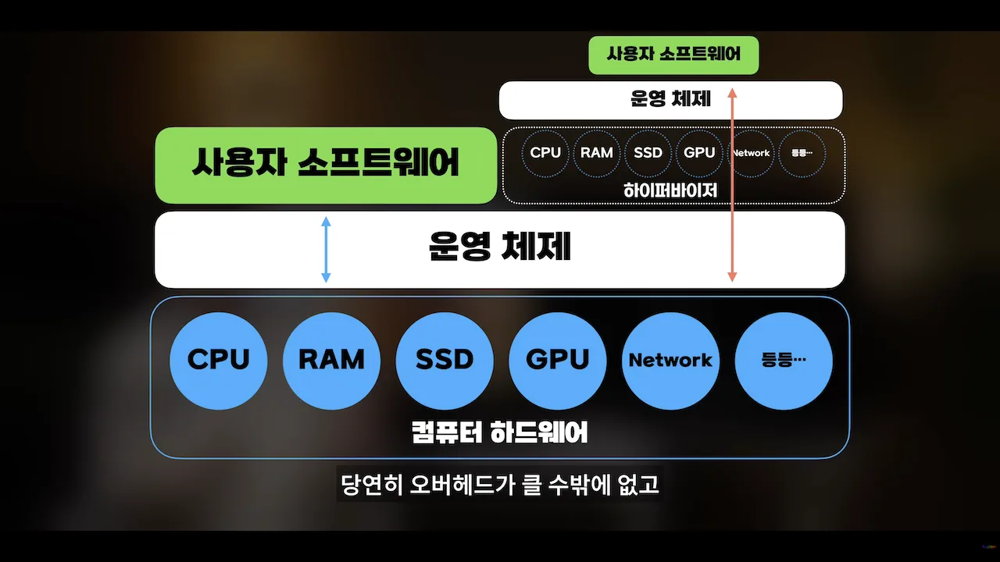
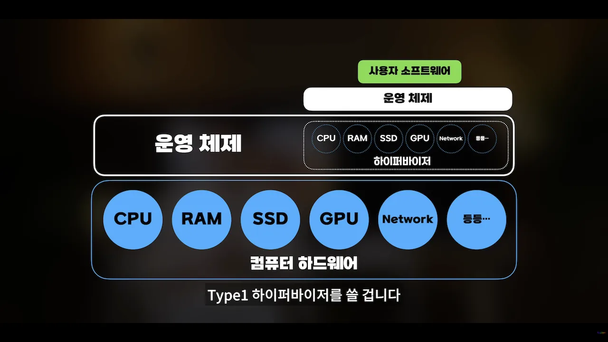
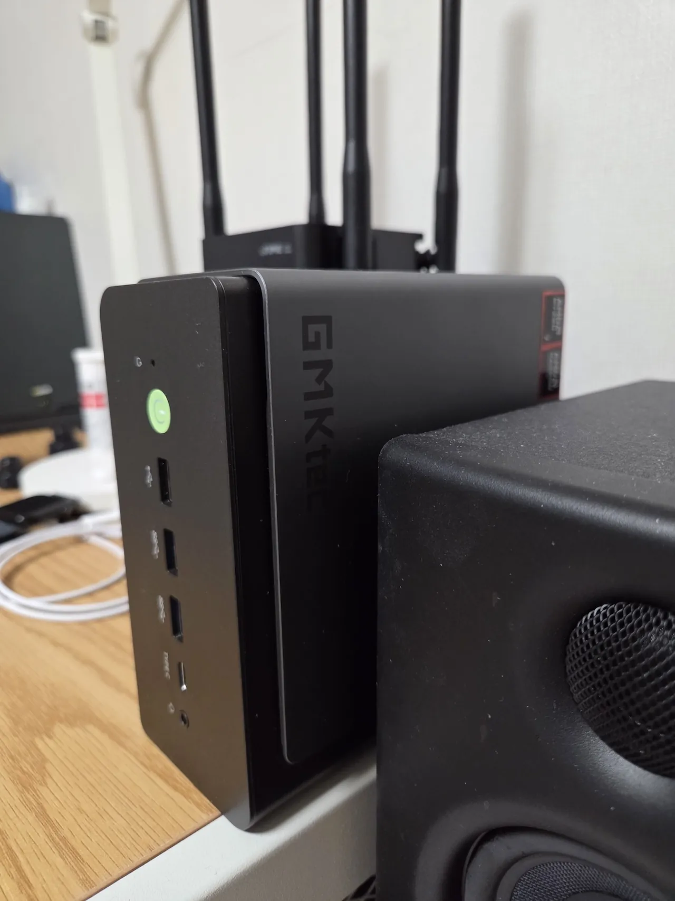

+++
date = '2026-02-28'
draft = false
title = 'Proxmox 하이퍼바이저 OS를 이용한 홈 서버 구축 [Ep.0 - 프롤로그]'
categories = [
    'Server&Network'
]
tags = [
    'homeserver', 'proxmox', 'hypervisor', 'virtualmachine'
]
image = 'teaser.webp'
+++

>[!WARNING] 주의사항
>본 게시글은 정확한 정보 전달 목적의 글이 아닌 홈 서버 구축 과정을 아카이빙 형태로 정리한 글입니다.

## 개요
IT와 테크에 관심이 많다 보니 예전부터 홈 서버에 대한 로망이 있었다.  
실제로 Synology DS1515+를 운용하고 있었고, 단순한 스토리지 서버를 넘어 Docker로 code-server를 올려보는 등 이것저것 실험도 해봤다.

과거에는 백업용 외장하드에 랜섬웨어가 걸려 데이터가 전부 날아간 적이 있어 그 뒤로 보안과 백업, 개인 스토리지 서버에 대한 관심이 더 커졌고, 이번에는 조금 더 본격적인 홈 서버를 구축해보고 싶다는 생각이 들었다.  
그러다 알게 된 것이 Proxmox라는 Type 1 하이퍼바이저 운영체제였다.

## 하이퍼바이저?
처음엔 하이퍼바이저라는 개념부터 낯설었다. 찾아보니 쉽게 말해 하나의 컴퓨터에서 여러 운영체제를 동시에 구동할 수 있게 해주는 기술이었다.
평소에도 메인 PC에 보안 프로그램을 설치하고 싶지 않아서 VMware 같은 가상머신 소프트웨어로 별도의 Windows를 띄워 사용하고 있었다. 이것도 결국 하이퍼바이저를 활용하는 방식이었다.
   
다만 운영체제 위에서 구동되는 하이퍼바이저 소프트웨어는 **Type 2 하이퍼바이저**라고 부른다.  
VMware, VirtualBox, Parallels Desktop 등이 여기에 해당한다.

그렇다면 개요에서 언급한 Type 1 하이퍼바이저 OS인 Proxmox는 무엇이 다를까?

> 이미지 출처: ColorScale YouTube  
> https://youtu.be/CYsJ7udTcPI?si=ZpFCq-Qh2qRCddGE

상기 이미지에서 Type1, 2 하이퍼바이저의 차이를 보기 쉽게 설명하고 있다.   
Type1 하이퍼바이저는 메인 운영체제 자체가 하이퍼바이저가 되어 자원들을 직접 제어할 수 있어 Type2 하이퍼바이저보다 오버헤드가 훨씬 적다.

## Proxmox를 선택한 이유
### 리눅스 기반의 무료 오픈소스 운영체제
우선 Proxmox는 데비안을 기반으로 한 오픈소스 운영체제다.   
물론 기업용 구독 라이선스가 따로 존재하긴 하지만, 개인 사용자는 비구독 리포지토리를 통해 충분히 실사용 가능한 수준으로 운영할 수 있다.   
홈 서버를 취미와 학습 목적으로 구축하는 입장에서는 이 점이 꽤 큰 장점이었다.   
게다가 이번 홈 서버 구축에는 학습 목적도 있었기 때문에, 자연스럽게 리눅스도 함께 익혀볼 수 있겠다는 생각이 들었다.

### WebUI 기반 관리
리눅스 운영체제에 대한 이해가 거의 없는 나에게 CLI 기반의 환경 보다는 관리화면이 갖춰진 GUI로 작업하는 것이 훨씬 편하게 느껴졌다.    
Proxmox 설치가 끝나면 https:/부여받은 사설IP주소:8006/ 으로 접속하여 WebUI기반으로 관리할 수 있다.   
웹 브라우저에서 VM과 LXC를 생성하고, 스토리지와 네트워크, 스냅샷, 백업까지 대부분의 작업을 처리할 수 있다는 점도 마음에 들었다.

### LXC 지원
사실 LXC는 Proxmox를 설치한 뒤에 알게 됐다.   
알아보니 LXC 컨테이너는 호스트 운영체제의 커널을 공유하면서, 여러 리눅스 시스템을 비교적 가볍게 실행할 수 있는 기술이었다.  
완전한 의미의 VM과는 다르게 100% 격리된 구조는 아니지만, 가장 큰 장점은 굉장히 가볍고 효율적이라는 점이다.  
특히 Docker 기반 서비스나 비교적 가벼운 작업을 올릴 때 잘 어울려 보였다.

### 스냅샷과 백업 기능
내가 원래 원했던 것도 결국 **"문제가 생겨도 쉽게 되돌릴 수 있는 환경"**이었다.   
그런 점에서 Proxmox의 스냅샷과 백업 기능이 굉장히 매력적으로 느껴졌다.
특정 시점의 VM 상태를 스냅샷으로 캡처해두고, 문제가 생기면 다시 그 시점으로 되돌릴 수 있다는 점은 초보인 나에게 과감한 시도를 해볼 수 있다는 장점으로 다가왔다.   
NAS에도 폴더별로 스냅샷 설정을 해뒀는데 랜섬웨어를 겪고 나서는 복구할 수 있는 환경 자체가 굉장히 중요하게 여겨진다.

### 홈 서버와 공부용
물론 이 프로젝트에 실용적인 이유만 있는 것은 아니다.   
사실 나는 실용성보다는 공부와 호기심의 영역이 더 크게 작용한다고 생각한다.(실까성까지 있으면 더 좋다)
실제로 배운 적도, 깊게 다뤄본 적도 없지만 네트워크, 가상화, 스토리지, 백업과 같은 것들을 직접 만져보고 싶다는 호기심이 컸다.   
추후 다른 글에서 더 자세히 정리하겠지만, Proxmox는 단순히 VM을 띄우는 수준을 넘어 방화벽, PBS(Proxmox Backup Server), 패스스루, 내부망 분리와 같은 구성까지 하나의 시스템에서 모두 동시에 구동할 수 있다!

## 서버가 될 컴퓨터 선정
### 남는 데스크탑
홈 서버를 제대로 구성해보고 싶다는 생각이 들게 만든 계기다.   
현재는 사용하지 않는 데스크탑이 있었는데 사양이 나쁘지 않아 그냥 유배시켜놓기에는 너무 아까웠던 것이다.

>**PC사양**   
>CPU: Intel Core i7-8700   
>RAM: DDR4 2666 8GB*4 (32GB)   
>VGA: NVIDIA GeForce GTX 1060 6GB   
>SSD: Samsung 970 Evo Plus 500GB   
>M/B: GIGABYTE B360M AORUS PRO   
>POWER: MICRONICS 600W (80PLUS)

처음에는 이 PC에 Proxmox OS를 설치하고 대략 2~3주 정도 이것저것 시도를 해봤다.   

하지만 아쉬운 부분들이 있었는데 크게는 부피와 전력소모다.   
미들타워 케이스 데스크탑이기 때문에 부피가 어느정도 차지한다는 점과 아이들 전력소모가 대략 50~60W 정도 됐다.   
요즘 최신PC에 비하면 착한 전력소모이긴 하지만 24시간 구동하는 서버다 보니 조금 신경이 쓰였다.

### 미니PC 충동구매
어느 순간부터 알고리즘에 미니PC가 점점 많이 뜨기 시작했다.  
마침 알리익스프레스에서 할인쿠폰을 뿌린다고 하여 새벽에 GMKtec K12 미니PC를 충동구매하고 말았다...  
가격은 조금 비싸게 주고 샀는데 관세 포함 44만원 정도 줬던 것 같다.

사실 처음부터 미니PC를 진지하게 고려했던 것은 아니다.  
남는 데스크탑도 충분히 잘 동작하고 있었고, 방열 솔루션은 오히려 더 좋았다.
그럼에도 자꾸 미니PC 쪽으로 마음이 기울었던 이유는 결국 “홈 서버는 24시간 켜둘 물건”이라는 점 때문이었다.  
미들타워 데스크탑은 생각보다 존재감이 크고, 전력 소모도 무시하기 어려웠다.
물론 i7-8700에 GTX 1060은 필요시에만 작동하기 때문에 아이들 50~60W 수준이긴 했지만 이마저도 24시간 동안 누적되면 무시못할 수준이다.  
반면 미니PC는 훨씬 작고 조용하며, 전력 효율도 좋아 보여서 ‘상시 구동 서버’라는 용도에 더 잘 맞아 보였다.

문제는 RAM과 SSD가 포함되지 않은 베어본 제품이었다는 점이다.  
요즘 램값이 너무 올라 새로 구입할 엄두가 나지 않았고, 게이밍 노트북에서 RAM과 SSD를 적출해 옮겨줬다.  

미니PC에 대한 자세한 리뷰는 추후 따로 올려볼 생각이다.  
사실 이 미니PC는 Proxmox 홈 서버 용도로 쓰기엔 사양이 꽤 넉넉한 편이라, 한편으로는 그냥 윈도우 머신으로 써도 되지 않을까 하는 생각도 들었다.  
그럼에도 2.5GbE RJ45 포트가 2개나 있다는 점은 굉장히 마음에 들었다.  
추후 서버망과 일반망을 분리하고, 방화벽 구성까지 생각이 있었기 때문에 더더욱 기대가 됐다.

무엇보다 가장 만족스러웠던 건 부피와 전력 소모였다.  
밸런스 모드 TDP는 54W지만, 아이들 시 전력 소모는 10W 내외로 측정되어 꽤 만족스러웠다.  
CPU 성능은 싱글코어, 멀티코어, 코어수, 전력소모 모든 면에서 i7-8700보다 압도적으로 좋아 여러 개의 VM과 LXC를 실행해도 쾌적한 환경이 기대된다.   
패스스루 지원이 되지 않아 Proxmox에서의 활용성은 낮지만 eGPU 연결을 위한 OCuLink 포트도 제공한다!(그더서 더 윈도우 머신으로 쓰고싶기도 했다)

## 마무리
처음에는 단순하게 남는 PC를 활용해봐야겠다는 생각에서 시작된 홈 서버 프로젝트가 조금 커지게 된 것 같다.   
다음 글에서는 실제로 Proxmox를 설치하고, 초기 설정을 어떻게 구성했는지 적어보려고 한다.